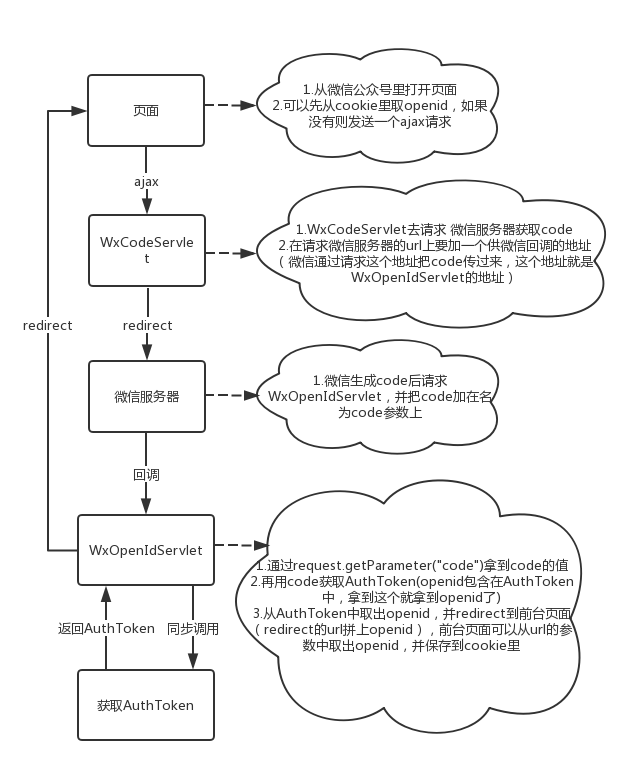

## 如何获取微信小程序用户openid？

获取微信OpenId
先获取code
再通过code获取auth token，从auth token中取出openid给前台
微信端一定不要忘记设定网页账号中的授权回调页面域名


## 流程图如下:



主要代码
页面js代码

```
/* 写cookie */
function setCookie(name, value) {
  var Days = 30;
  var exp = new Date();
  exp.setTime(exp.getTime() + Days * 24 * 60 * 60 * 1000);
  document.cookie = name + "=" + escape(value) + ";expires=" + exp.toGMTString() + ";path=/";
}
/* 读cookie */
function getCookie(name) {
  var arr = document.cookie.match(new RegExp("(^| )" + name + "=([^;]*)(;|$)"));
  if (arr != null) {
    return unescape(arr[2]);
  }
  return null;
}
/* 获取URL参数 */
function getUrlParams(name) {
  var reg = new RegExp("(^|&)" + name + "=([^&]*)(&|$)", "i");
  var r = window.location.search.substr(1).match(reg);
  if (r != null) {
    return unescape(r[2]);
  }
  return null;
}
/* 获取openid */
function getOpenId(url) {
  var openid = getCookie("usropenid");
  if (openid == null) {
    openid = getUrlParams('openid');
    alert("openid="+openid);
    if (openid == null) {
      window.location.href = "wxcode?url=" + url;
    } else {
      setCookie("usropenid", openid);
    }
  }
}
```

WxCodeServlet代码

```
//访问微信获取code
@Override
protected void doPost(HttpServletRequest req, HttpServletResponse resp)
    throws ServletException, IOException {
  String state = req.getParameter("url");
  //WxOpenIdServlet的地址
  String redirect ="http://"+Configure.SITE+"/wxopenid";
  redirect = URLEncoder.encode(redirect, "utf-8");
  StringBuffer url = new StringBuffer("https://open.weixin.qq.com/connect/oauth2/authorize?appid=")
      .append(Configure.APP_ID).append("&redirect_uri=").append(redirect)
      .append("&response_type=code&scope=snsapi_base&state=").append(state).append("#wechat_redirect");
  resp.sendRedirect(url.toString());
}
```

WxOpenIdServlet代码

```
//访问微信获取openid
@Override
protected void doPost(HttpServletRequest req, HttpServletResponse resp)
    throws ServletException, IOException {
  String code = req.getParameter("code");
  String state = req.getParameter("state");
  Result ret = new Result();
  AuthToken token = WXUtil.getAuthToken(code);
  if(null != token.getOpenid()){
    ret.setCode(0);
    log.info("====openid=="+token.getOpenid());
    Map<String,String> map = new HashMap<String,String>();
    map.put("openid", token.getOpenid());
    map.put("state", state);
    ret.setData(map);
  }else{
    ret.setCode(-1);
    ret.setMsg("登录错误");
  }
  String redUrl = state+"?openid="+token.getOpenid();
  resp.sendRedirect(redUrl);
}
```

获取AuthToken（WXUtil.getAuthToken(code)）代码

```
public static AuthToken getAuthToken(String code){
  AuthToken vo = null;
  try {
    String uri = "https://api.weixin.qq.com/sns/oauth2/access_token?";
    StringBuffer url = new StringBuffer(uri);
    url.append("appid=").append(Configure.APP_ID);
    url.append("&secret=").append(Configure.APP_SECRET);
    url.append("&code=").append(code);
    url.append("&grant_type=").append("authorization_code");
    HttpURLConnection conn = HttpClientUtil.CreatePostHttpConnection(url.toString());
    InputStream input = null;
    if (conn.getResponseCode() == 200) {
      input = conn.getInputStream();
    } else {
      input = conn.getErrorStream();
    }
    vo = JSON.parseObject(new String(HttpClientUtil.readInputStream(input),"utf-8"),AuthToken.class);
  } catch (Exception e) {
    log.error("getAuthToken error", e);
  }
  return vo;
}
```

HttpClientUtil类

```
package com.huatek.shebao.util;
import java.io.ByteArrayOutputStream;
import java.io.DataOutputStream;
import java.io.IOException;
import java.io.InputStream;
import java.net.HttpURLConnection;
import java.net.MalformedURLException;
import java.net.ProtocolException;
import java.net.URL;
public class HttpClientUtil {
  // 设置body体
  public static void setBodyParameter(String sb, HttpURLConnection conn)
      throws IOException {
    DataOutputStream out = new DataOutputStream(conn.getOutputStream());
    out.writeBytes(sb);
    out.flush();
    out.close();
  }
  // 添加签名header
  public static HttpURLConnection CreatePostHttpConnection(String uri) throws MalformedURLException,
      IOException, ProtocolException {
    URL url = new URL(uri);
    HttpURLConnection conn = (HttpURLConnection) url.openConnection();
    conn.setUseCaches(false);
    conn.setDoInput(true);
    conn.setDoOutput(true);
    conn.setRequestMethod("POST");
    conn.setInstanceFollowRedirects(true);
    conn.setConnectTimeout(30000);
    conn.setReadTimeout(30000);
    conn.setRequestProperty("Content-Type","application/json");
    conn.setRequestProperty("Accept-Charset", "utf-8");
    conn.setRequestProperty("contentType", "utf-8");
    return conn;
  }
  public static byte[] readInputStream(InputStream inStream) throws Exception {
    ByteArrayOutputStream outStream = new ByteArrayOutputStream();
    byte[] buffer = new byte[1024];
    int len = 0;
    while ((len = inStream.read(buffer)) != -1) {
      outStream.write(buffer, 0, len);
    }
    byte[] data = outStream.toByteArray();
    outStream.close();
    inStream.close();
    return data;
  }
}
```

封装AuthToken的VO类

```
package com.huatek.shebao.wxpay;
public class AuthToken {
  private String access_token;
  private Long expires_in;
  private String refresh_token;
  private String openid;
  private String scope;
  private String unionid;
  private Long errcode;
  private String errmsg;
  public String getAccess_token() {
    return access_token;
  }
  public void setAccess_token(String access_token) {
    this.access_token = access_token;
  }
  public Long getExpires_in() {
    return expires_in;
  }
  public void setExpires_in(Long expires_in) {
    this.expires_in = expires_in;
  }
  public String getRefresh_token() {
    return refresh_token;
  }
  public void setRefresh_token(String refresh_token) {
    this.refresh_token = refresh_token;
  }
  public String getOpenid() {
    return openid;
  }
  public void setOpenid(String openid) {
    this.openid = openid;
  }
  public String getScope() {
    return scope;
  }
  public void setScope(String scope) {
    this.scope = scope;
  }
  public String getUnionid() {
    return unionid;
  }
  public void setUnionid(String unionid) {
    this.unionid = unionid;
  }
  public Long getErrcode() {
    return errcode;
  }
  public void setErrcode(Long errcode) {
    this.errcode = errcode;
  }
  public String getErrmsg() {
    return errmsg;
  }
  public void setErrmsg(String errmsg) {
    this.errmsg = errmsg;
  }
}
```

微信小程序 实现了应用“触手可及”的梦想，用户扫一扫或搜一下即可打开应用。不用安装，即开即用，用完就走。省流量，省安装时间，不占用桌面。对用户使用上来说，确实方便，没有繁琐的注册，没有反复的验证，只要你是微信用户，他就隐藏在你的微信里面，要用的时候打开，不用的时候关掉，即用即走。这点比需要下载，还要占用手机内存空间的APP要好。 高效便捷的获取客流量，对于小程序拥有者来说，相较于原生APP，推广更容易更简单，更省成本。微信小程序意味着有多少人使用微信，就有多少人会使用小程序，共享9亿+微信现成活跃用户。相比app，小程序拥有众多流量入口，获客更高效便捷。搜索功能让你脱颖而出：腾讯为小程序开放了搜索功能，就是说只要你有了自己的小程序，大家在搜索里就可以找到你；附近小程序流量开放是你引流的利器：只要你自己开发了小程序，除了微信搜索能找到你以外，微信开放流量，让你自动出现在别人手机附近小程序的序列里。